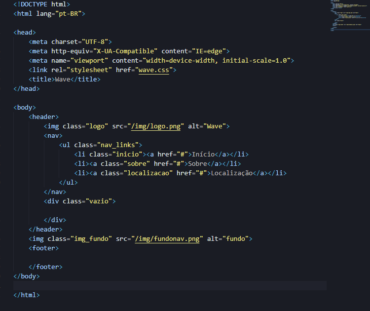

# Wave

<!---Esses são exemplos. Veja https://shields.io para outras pessoas ou para personalizar este conjunto de escudos. Você pode querer incluir dependências, status do projeto e informações de licença aqui--->

> Projeto de site de fast food simples feito para um trabalho de escola.

### Ajustes e melhorias

O projeto ainda está em desenvolvimento e as próximas atualizações serão voltadas nas seguintes tarefas:

- [x] NavBar
- [x] Estrutura das Páginas
- [x] Formatação das Páginas
- [x] Footer
- [ ] Responsividade

## 🤝 Responsáveis

As seguintes pessoas foram responsáveis por esse projeto:

<table>
  <tr>
    <td align="center">
      <a href="https://github.com/uuMnnoPedrin">
         
        
          <b>Pedro Veiga Ribeiro</b>
        
      </a>
    </td>
  </tr>
</table>

[⬆ Voltar ao topo](#Wave) 
